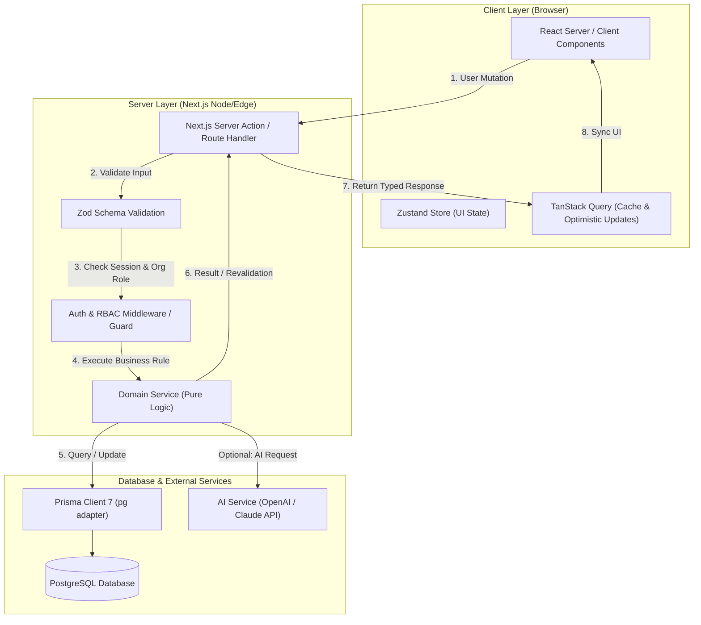

# Kyzen System Architecture & Design Decisions

## 1. Tech Stack Overview

| Layer | Technology | Rationale & Tradeoffs |
|---|---|---|
| **Framework** | Next.js 16 (App Router, Turbopack) | Server Components by default for optimal performance and SEO; Server Actions for mutations. |
| **Language** | TypeScript 5 (Strict Mode) | Full-stack end-to-end type safety. |
| **UI Library & CSS** | React 19, Tailwind CSS v4, Base UI / Radix primitives, Lucide Icons | Composable, accessible design system with atomic utility styling. |
| **Database & ORM** | PostgreSQL + Prisma ORM 7 (`@prisma/adapter-pg`) | Robust relational data integrity with driver adapter architecture for connection pooling. |
| **Auth** | Auth.js (NextAuth v5) | Secure session handling, OAuth adapters, native App Router support. |
| **State Management** | Zustand (Client-side UI state), TanStack Query v5 (Server State & Caching) | Decouples complex modal/editor state from data fetching and mutation lifecycles. |
| **Validation** | Zod | Runtime schema validation across forms, server actions, and API boundaries. |

---

## 2. Directory & Component Architecture

Kyzen uses a **Feature-Driven Architecture** combined with Next.js App Router conventions:

```
kyzen/
├── actions/             # Next.js Server Actions (mutations across domains)
├── app/                 # Next.js App Router (Routing, Layouts, Route Handlers)
│   ├── (auth)/          # Auth route group (sign-in, sign-up, callbacks)
│   ├── (dashboard)/     # Main application shell (sidebar, workspaces, projects)
│   ├── (marketing)/     # Landing page, public product showcases
│   └── api/             # Webhook handlers, external integrations, REST endpoints
├── components/
│   ├── ui/              # Reusable atomic UI primitives (buttons, dialogs, inputs)
│   ├── layout/          # Global layout elements (sidebar, navbar, command menu)
│   └── shared/          # Shared complex widgets (avatar groups, empty states)
├── features/            # Feature-encapsulated modules
│   ├── auth/            # Auth forms, session hooks, guards
│   ├── organizations/   # Org switcher, member management, invite modals
│   ├── projects/        # Project settings, project list, cards
│   ├── kanban/          # Board columns, task cards, drag-and-drop logic
│   ├── tasks/           # Task details drawer, task creation, filters
│   └── ai/              # Prompt builders, streaming handlers, AI assistants
├── hooks/               # Generic reusable React hooks
├── lib/                 # Core singletons and configurations (prisma, auth, env, utils)
├── prisma/              # Database schema, migrations, seed scripts
├── services/            # Pure business logic layer decoupled from Next.js request context
└── types/               # Global TypeScript definitions & DTOs
```

---

## 3. Data Flow & Mutation Architecture



---

## 4. Key Architectural Patterns & Guidelines

### 4.1. Server Components vs. Client Components
- **Server Components (RSC) by Default:** Use RSC for data fetching, static rendering, and layout structure to reduce client bundle size.
- **Client Components (`'use client'`):** Reserve for interactive components (forms, modals, drag-and-drop boards, dropdown menus).

### 4.2. Database & Data Isolation (Multi-Tenancy)
- Every query operating on project or task resources **must** include an explicit tenant check (`organizationId` or membership verification).
- Never trust client-supplied organization or project IDs without validating user permissions against the session in the backend service layer.

### 4.3. Error Handling & Validation
- Never let unhandled exceptions leak internal database details or stack traces to the client.
- All Server Actions return a standardized result object:
  ```typescript
  type ActionResponse<T> = 
    | { success: true; data: T }
    | { success: false; error: string; fieldErrors?: Record<string, string[]> };
  ```
